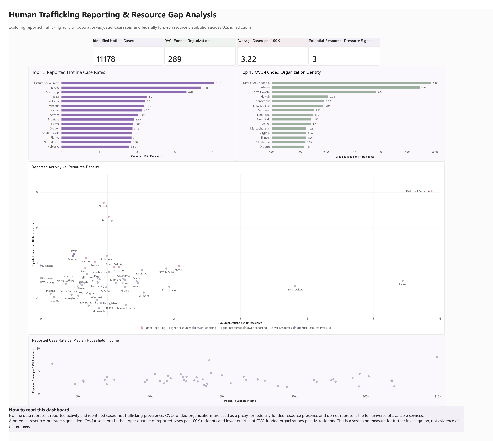
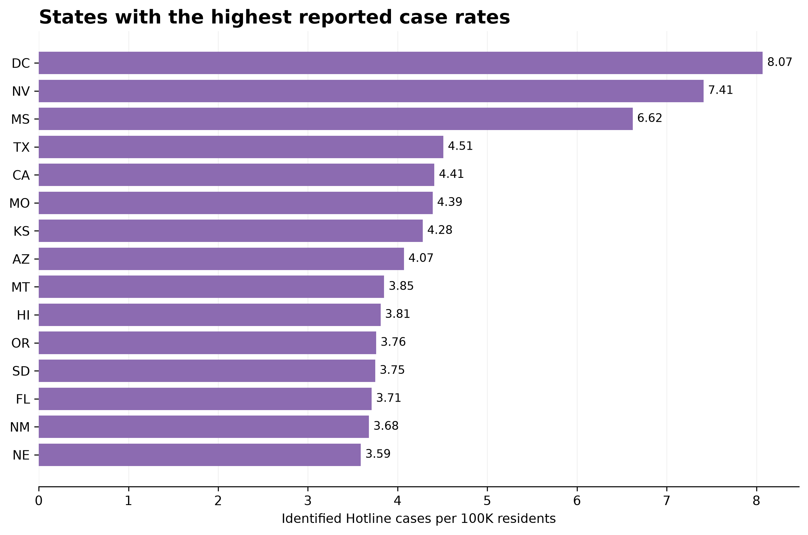
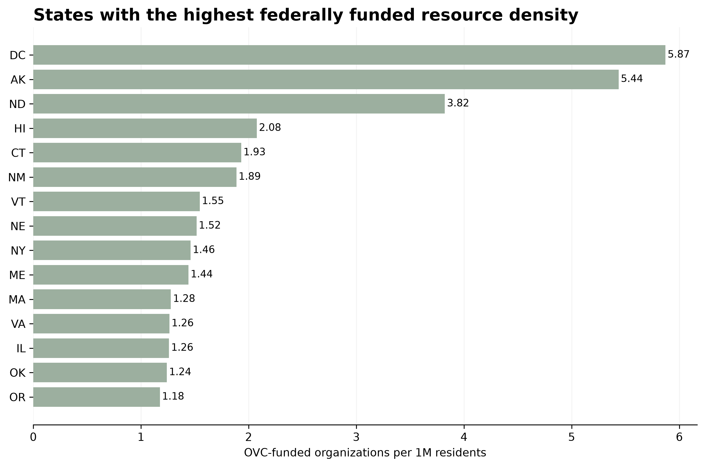
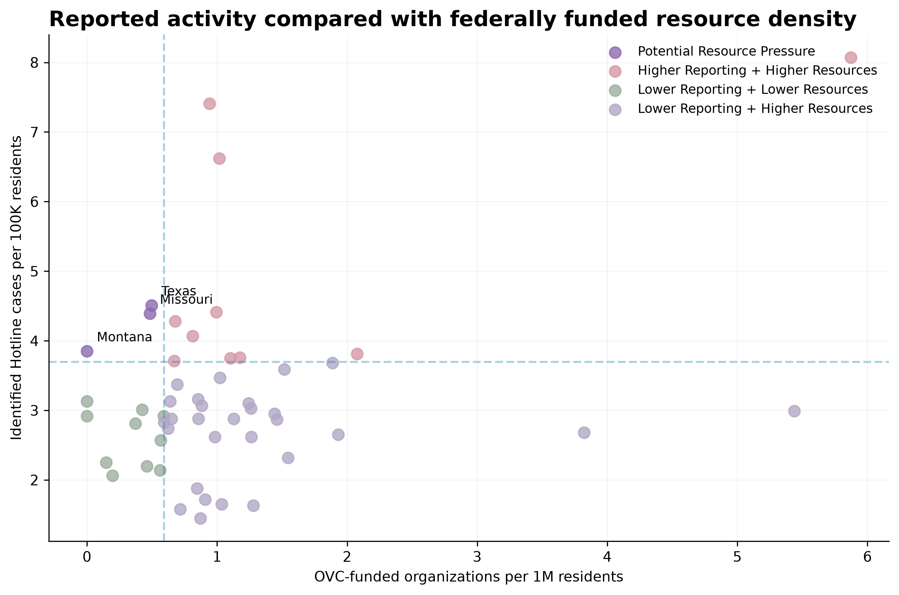
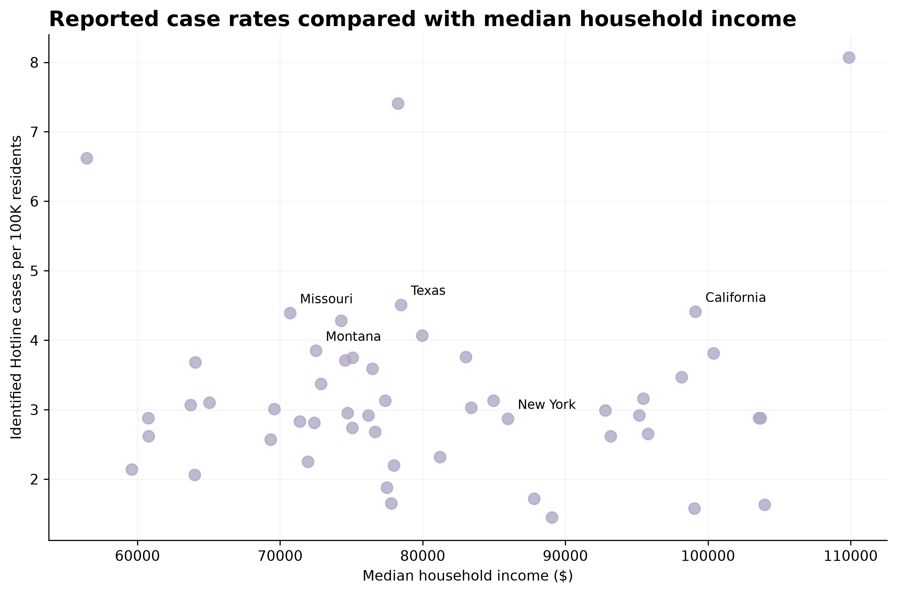

# Human Trafficking Reporting & Resource Gap Analysis



**Dashboard:** Power BI dashboard summarizing reported case rates, OVC-funded resource density, and potential resource-pressure signals across U.S. jurisdictions.

## About the Project

I built this project to look at reported human trafficking activity across the U.S. and compare it with the distribution of federally funded anti-trafficking resources.

I was interested in whether places with higher levels of reported trafficking activity also had similar levels of federally funded resources available. Instead of only looking at raw case counts, I adjusted the data for population size and compared reporting rates with OVC-funded organizational density.

The goal was not to estimate the actual prevalence of human trafficking. I wanted to use publicly available data to see what patterns stood out and identify areas that may be worth looking into further.

## Questions I Wanted to Answer

- Which states had the highest reported trafficking case rates in 2024?
- How did those patterns change after adjusting for population?
- Where were federally funded trafficking-related organizations concentrated?
- Were there jurisdictions with relatively high reported activity but relatively low federally funded resource density?
- Did reported case rates show any relationship with income, poverty, or unemployment?

## Data

This project combines three main public data sources.

### National Human Trafficking Hotline

2024 state-level reporting data, including signals and identified cases.

### U.S. Census Bureau

2024 American Community Survey 5-year estimates for population, median household income, poverty, and unemployment.

### Office for Victims of Crime / USAspending

Federal award data for selected OVC trafficking-related programs, including Assistance Listing numbers 16.320 and 16.035.

## Analysis

The project was built in Python using pandas, NumPy, Matplotlib, and requests.

Some of the main measures I created were:

- Identified Hotline cases per 100,000 residents
- OVC-funded organizations per 1 million residents
- OVC-funded awards per 1 million residents
- Cases per funded organization

I also created a resource-pressure signal. A jurisdiction was included in this group when it had a reported case rate in the upper quartile and OVC-funded organizational density in the lower quartile.

This was used as a way to flag areas for further investigation, not as proof that a jurisdiction has inadequate services.

## Key Findings

### Population adjustment changed the picture

Raw case counts naturally favor larger states. Population-adjusted reporting rates showed a different pattern, with several smaller jurisdictions ranking much higher than they did by total case count.

### Federal resource density varied

The number of OVC-funded organizations per 1 million residents differed considerably across jurisdictions. This provided a different perspective from simply looking at the total number of organizations or awards.

### Three jurisdictions showed a potential resource-pressure signal

Texas, Missouri, and Montana fell into the combination of relatively high reported case rates and relatively low OVC-funded organizational density used in this analysis.

These results should be treated as a starting point for further research rather than evidence of a confirmed resource shortage.

### Income showed little relationship with reported case rates

The Spearman correlation between median household income and reported cases per 100,000 residents was approximately -0.02. Poverty and unemployment both showed weak positive correlations of approximately 0.27.

These relationships are descriptive and do not establish causation.

## Visualizations

### States with the highest reported case rates

Population-adjusted reporting rates make it easier to compare jurisdictions of different sizes.



### Federal resource density

This shows OVC-funded organizations per 1 million residents.



### Reported activity vs. resource density

This was the main comparison in the project. It shows reported case rates alongside federally funded organizational density and highlights the jurisdictions identified as potential resource-pressure signals.



### Reported case rates vs. household income

This visualization provides additional socioeconomic context for the reported case-rate patterns.



## Limitations

There are several important limitations to this analysis.

The National Human Trafficking Hotline data represent reports and identified cases received by the Hotline. They do not represent the true prevalence of human trafficking. Differences between jurisdictions can also reflect differences in awareness, reporting behavior, access to the Hotline, and other factors.

The OVC resource measure only captures federally funded organizations identified through the selected programs and USAspending data. It is not a complete list of trafficking service providers or available resources in each jurisdiction.

The resource-pressure classification is based on quartile thresholds and is intended as a screening method. It does not prove that a jurisdiction has unmet need or insufficient services.

The socioeconomic analysis is also descriptive. Correlation does not mean that income, poverty, or unemployment causes differences in reported trafficking activity.

## Project Structure

```text
human-trafficking-resource-gap-analysis/
│
├── README.md
│
├── data/
│   ├── raw/
│   └── cleaned/
│
├── images/
│
├── notebooks/
│   ├── 01_data_collection_hotline.ipynb
│   ├── 02_hotline_cleaning.ipynb
│   ├── 03_population_adjustment.ipynb
│   ├── 04_socioeconomic_context.ipynb
│   ├── 05_federal_resource_data.ipynb
│   └── 06_resource_gap_analysis.ipynb
│
├── reports/
│   └── data_dictionary.md
│
└── sql/

Tools
Python
pandas
NumPy
Matplotlib
Requests
Jupyter Notebook
VS Code
Git/GitHub
Power BI

Sources
National Human Trafficking Hotline
https://humantraffickinghotline.org/en/statistics
U.S. Census Bureau — 2024 ACS 5-Year Data
https://www.census.gov/data/developers/data-sets/acs-5year/2024.html
Office for Victims of Crime — Human Trafficking Overview
https://www.ovc.ojp.gov/program/human-trafficking/overview
Office for Victims of Crime — Human Trafficking Grants & Funding
https://www.ovc.ojp.gov/program/human-trafficking/grants-funding
USAspending
https://www.usaspending.gov/